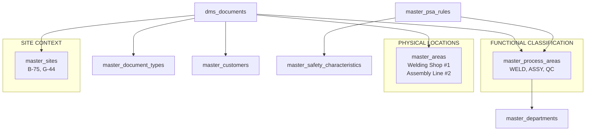

# KaizenDMS - KaizenMasters Integration Summary

> **Integration Approach:** Leverage existing KaizenMasters infrastructure + Add DMS-specific masters  
> **Request Document:** `dms_master_data_request_corrected.json` (VALIDATED & CORRECTED)  
> **Status:** Ready for KaizenMasters team review  
> **Critical Update:** Removed invalid areas extension after validation

---

## ⚠️ **CRITICAL VALIDATION ISSUE RESOLVED**

### **Problem Identified**
Initial request incorrectly attempted to extend existing `master_areas` table for DMS process area needs.

### **Root Cause** 
- **Existing `master_areas`:** Physical locations within sites ("Welding Shop #1", "Assembly Line #2")
- **DMS Needs:** Functional process classifications ("Welding", "Assembly", "Quality Control")
- **Impact:** Different concepts that cannot be mixed without breaking data model integrity

### **Resolution**
- ❌ **REMOVED:** Extension request for `master_areas`  
- ✅ **ADDED:** New `master_process_areas` table for functional process classification
- ✅ **RESULT:** Clean separation of physical location management vs process classification

---

## Integration Strategy

### ✅ **REUSE Existing Masters (4 tables)**
We will directly use existing KaizenMasters tables without any extensions:

| Master Table | Usage in DMS | Fields Used | Extension Needed |
|--------------|--------------|-------------|------------------|
| **`master_sites`** | Document location assignment | `id`, `name`, `code`, `address`, `timezone` | ❌ None |
| **`master_departments`** | Document ownership & approval workflows | `id`, `name`, `code` | ❌ None |
| **`master_customers`** | Basic customer identification for documents | `id`, `name`, `code`, `customer_type` | ❌ None (CSR via dedicated module) |
| **`master_suppliers`** | Supplier qualification documents | `id`, `name`, `code`, `supplier_type`, certifications | ❌ None |

### ❌ **CANNOT REUSE** 
| Master Table | Reason | Alternative Solution |
|--------------|--------|----------------------|
| **`master_areas`** | Represents physical locations, not functional processes | Create `master_process_areas` |

### 🆕 **CREATE New Masters (6 tables)**
DMS-specific masters that will be used across multiple modules:

| New Master Table | Purpose | Records | Cross-Module Usage |
|------------------|---------|---------|-------------------|
| **`master_process_areas`** | ⚠️ **CRITICAL** - Functional process classification | ~12 | DMS, SafetyModule, QualityModule |
| **`master_document_types`** | Document classification & auto-numbering | ~15 | DMS, QualityModule, AuditModule |
| **`master_languages`** | Multilingual support | ~5 | DMS, UserInterface, ReportingModule |
| **`master_safety_characteristics`** | Safety compliance definitions | ~20 | DMS, SafetyModule, QualityModule |
| **`master_psa_rules`** | PSO approval automation | ~15 | DMS, TaskEngine, SafetyModule |
| **`master_review_cycles`** | Document review scheduling | ~8 | DMS, TaskEngine, QualityModule |

---

## Data Model Architecture

### **Corrected Relationship Design**



### **Use Case Examples**

```sql
-- Example 1: Site-independent safety rule
-- "All welding processes require PSO approval for belt anchorage"
PSA Rule: process_area = 'WELD' + safety_characteristic = 'BELT_ANC'
→ Applies to welding at B-75, G-44, and any future sites

-- Example 2: Document with complete context
Document: "Welding WI for Site B-75 Shop #1"
├── site_id = 1 (B-75 site)
├── process_area_id = 1 (Welding process type)
└── physical_area_id = 5 (Welding Shop #1) [OPTIONAL]

-- Example 3: Process-centric reporting
"All welding documents across enterprise" 
WHERE process_area_id = 1
→ Gets welding docs from all sites, all physical locations
```

---

## Benefits of Corrected Approach

### 🎯 **Immediate Benefits**
- **Correct Data Model:** Clean separation of concerns between physical and functional classification
- **Scalable Design:** Process rules work across all sites automatically  
- **Future-Proof:** New sites inherit process area rules without manual setup
- **Compliance Ready:** Safety rules apply consistently across enterprise

### 🔄 **Avoided Problems**  
- **Document Fragmentation:** Would have tied docs to specific physical locations
- **Rule Duplication:** Would have needed PSO rules per physical location
- **Site Scalability Issues:** New sites would break existing document references
- **Reporting Complexity:** Cross-site process analysis would be impossible

---

## Implementation Timeline

### Week 1: KaizenMasters Changes
- **Day 1-2:** Create 6 new master tables (including critical `master_process_areas`)
- **Day 3:** Extend `master_customers` table with CSR requirements
- **Day 4:** Set up permissions and seed comprehensive initial data
- **Day 5:** Integration testing with emphasis on process area vs physical area distinction

### Week 2: DMS Integration  
- **Day 1-2:** Update DMS to use corrected master data relationships
- **Day 3-4:** Implement process-area-based PSO gates and auto-numbering
- **Day 5:** End-to-end testing with multi-site scenarios

---

## Data Seeding Examples

### Process Areas (New - CRITICAL)
```sql
INSERT INTO master_process_areas (area_code, area_name, safety_critical_default, pso_oversight_required, department_id) VALUES
('WELD', 'Welding', TRUE, TRUE, 1),          -- All welding processes
('ASSY', 'Assembly', TRUE, TRUE, 1),         -- All assembly processes  
('STITCH', 'Stitching', FALSE, FALSE, 1),    -- All stitching processes
('QC', 'Quality Control', FALSE, FALSE, 2),  -- All QC processes
('INSP', 'Incoming Inspection', FALSE, FALSE, 2),
('PAINT', 'Painting', FALSE, FALSE, 1),
('MAINT', 'Maintenance', TRUE, FALSE, 3),
('SAFE', 'Safety Procedures', TRUE, TRUE, 4);
```

### PSA Rules (Linked to Process Areas)
```sql
INSERT INTO master_psa_rules (rule_code, rule_name, trigger_process_area, condition_regex, pso_required) VALUES
('WELD_BELT', 'Welding Belt Anchorage', 'WELD', '(?i).*(belt|anchorage|mounting).*', TRUE),
('ASSY_BELT', 'Assembly Belt Anchorage', 'ASSY', '(?i).*(belt|anchorage|mounting).*', TRUE),
('WELD_STRENGTH', 'Welding Strength', 'WELD', '(?i).*(weld.*strength|structural.*weld).*', TRUE);
-- These rules work across ALL sites for the specified process areas
```

### Customer Extensions
```sql  
UPDATE master_customers 
SET csr_requirements = '{"flame_retardant": true, "special_testing": ["vibration"], "documentation": "Marathi_required"}',
    ppap_required = TRUE,
    quality_rating = 'A'
WHERE code = 'GSRTC';
```

---

## Permission Requirements

### New Permissions Needed
```json
{
  "process_areas": ["view", "create", "edit", "delete"],
  "document_types": ["view", "create", "edit", "delete"],
  "languages": ["view", "create", "edit", "delete"], 
  "safety_characteristics": ["view", "create", "edit", "delete"],
  "psa_rules": ["view", "create", "edit", "delete"],
  "review_cycles": ["view", "create", "edit", "delete"]
}
```

### Existing Permissions Used
```json
{
  "sites": ["view"],
  "departments": ["view"],
  "customers": ["view", "edit"],
  "suppliers": ["view"]
}
```

**NOTE:** `areas.view` and `areas.edit` permissions **REMOVED** from request as we're not extending that table.

---

## Quality Assurance Plan

### Database Validation
- [ ] **Process Area Independence:** Verify process areas work across multiple sites
- [ ] **PSO Rule Functionality:** Test safety rules trigger for process types, not locations
- [ ] **Document Classification:** Confirm documents can reference both process and physical areas
- [ ] **Foreign Key Integrity:** All relationships properly constrained
- [ ] **Performance Testing:** Queries perform within 100ms targets

### Integration Testing  
- [ ] **Multi-Site PSO Rules:** Same process area rule works at B-75 and G-44
- [ ] **Document Retrieval:** Can find "all welding documents" across sites
- [ ] **Auto-Numbering:** Document IDs generate correctly using process areas
- [ ] **Safety Gates:** PSO approval triggers for process type regardless of location
- [ ] **Review Cycles:** Periodic reviews work based on document type and process area

### Rollback Testing
- [ ] **Clean Removal:** All 6 new tables can be dropped without affecting existing modules
- [ ] **Customer Extensions:** CSR fields can be removed without breaking existing functionality
- [ ] **No Orphan Data:** Rollback leaves no dangling references

---

## Critical Success Factors

### ✅ **What Makes This Work**
1. **Correct Conceptual Model:** Physical locations vs functional processes properly separated
2. **Enterprise Scalability:** Process rules automatically apply to new sites
3. **Cross-Module Reusability:** Process areas will benefit Quality and Safety modules
4. **Compliance Architecture:** PSO rules work consistently across entire enterprise
5. **Future-Proof Design:** Ready for additional sites and process types

### ⚠️ **Risks & Mitigations**
| Risk | Mitigation |
|------|------------|
| **Conceptual confusion** | Clear documentation distinguishing process vs physical areas |
| **Data migration complexity** | Comprehensive seed data and mapping guidelines |
| **Performance with new relationships** | Proper indexing and query optimization |
| **User training needs** | Clear examples and use case documentation |

---

## Validation Summary

### **Issue Resolution**
- **Original Problem:** Attempted to reuse `master_areas` for functional process classification
- **Validation Result:** Existing table serves different purpose (physical locations)
- **Solution:** Created separate `master_process_areas` for functional classification
- **Benefit:** Clean data model with proper separation of concerns

### **Key Lesson**
Always validate the **business purpose** and **data scope** of existing master tables before assuming reusability. Table names can be misleading - focus on actual usage patterns and data structure.

---

## Next Steps

### 1. KaizenMasters Team Action Required
- [ ] Review corrected `dms_master_data_request_corrected.json`
- [ ] Approve 6 new master tables design  
- [ ] Confirm understanding of process areas vs physical areas distinction
- [ ] Schedule implementation in development environment

### 2. DMS Team Preparation  
- [ ] Update all integration code to use `master_process_areas` instead of `master_areas`
- [ ] Prepare process area classification guidelines for legacy data migration
- [ ] Create comprehensive test scenarios covering multi-site process area usage
- [ ] Update documentation to clarify functional vs physical area concepts

### 3. Joint Validation
- [ ] Multi-site end-to-end workflow testing
- [ ] Process-area-based PSO rule validation
- [ ] Document classification accuracy testing
- [ ] Cross-site reporting and analytics validation

## 🔗 **Customer Requirements Integration**

### **Architectural Decision**
Customer Specific Requirements (CSR) will be managed by a **dedicated Customer Requirements Module** rather than extending `master_customers` table.

### **Benefits of Separate Module**
- **Modularity:** Clean separation of concerns between customer identification and requirement management
- **Scalability:** Complex requirement hierarchies, versioning, and approval workflows
- **Reusability:** Other modules (Quality, Safety, Production) can integrate with same requirements
- **Future-Proof:** Requirements can evolve independently without affecting core customer data

### **DMS Integration Points**
```javascript
// Document Creation - Auto-tag with customer requirements
CustomerReq.getApplicableRequirements(customer_id, process_area, doc_type)
→ Returns requirement flags for document tagging

// PSO Gate Logic - Trigger additional approvals
CustomerReq.hasRequirement(customer_id, 'flame_retardant') 
→ Adds fire safety officer to approval chain

// PPAP Generation - Customer-specific packages
CustomerReq.getPPAPRequirements(customer_id)
→ Returns PPAP level, language, format requirements

// Document Numbering - Custom prefixes
CustomerReq.getNumberingRules(customer_id)
→ Returns customer-specific numbering patterns

// Compliance Search - Find matching customers
CustomerReq.getCustomersWithRequirements(['flame_retardant', 'vibration_testing'])
→ Returns list of customers with specific requirements
```

### **Webhook Integration**
- **Requirement Updates:** DMS re-evaluates affected documents when customer requirements change
- **New Requirements:** Triggers review cycles for existing documents to ensure compliance

---

## Contact Information

| Role | Contact | Responsibility |
|------|---------|---------------|
| **DMS Technical Lead** | dms-dev@kaizen.com | Corrected integration implementation |
| **KaizenMasters Team** | dev@kaizen.com | Master data schema validation and creation |
| **Data Architecture Review** | architecture@kaizen.com | Data model validation |
| **Business Stakeholder** | qa@kaizen.com | Process area classification validation |

---

*This corrected integration approach ensures KaizenDMS builds on the solid foundation of KaizenMasters while maintaining proper data model integrity and supporting scalable, enterprise-wide document management.*